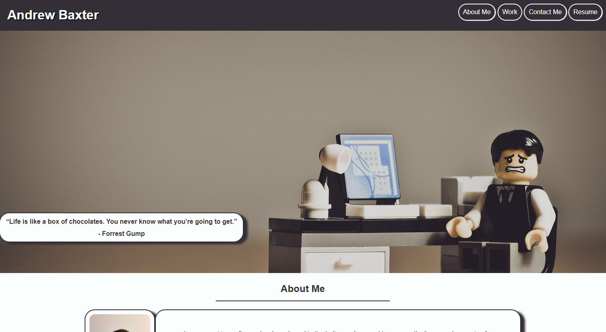

# My First Portfolio Site

Link to Site: https://asbaxter.github.io/my-portfolio/

This is my first attempt at building a resposive and interactive website. The goal of this project was to create a webpage that was functional and interactive on all media platforms. Create code that was well orginized and effecient and a webpage that could be easily changed and altered through variables. This was a great challenge building a website from scratch. I was able to learn a lot from creating this website and all in all I am happy with the result. 

# acceptance criteria:

GIVEN I need to sample a potential employee's previous work__
WHEN I load their portfolio__
THEN I am presented with the developer's name, a recent photo or avatar, and links to sections about them, their work, and how to contact them__
WHEN I click one of the links in the navigation__
THEN the UI scrolls to the corresponding section__
WHEN I click on the link to the section about their work__
THEN the UI scrolls to a section with titled images of the developer's applications__
WHEN I am presented with the developer's first application__
THEN that application's image should be larger in size than the others__
WHEN I click on the images of the applications__
THEN I am taken to that deployed application__
WHEN I resize the page or view the site on various screens and devices__
THEN I am presented with a responsive layout that adapts to my viewport__